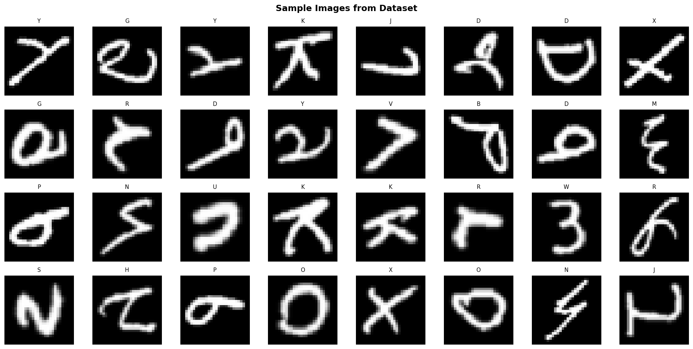
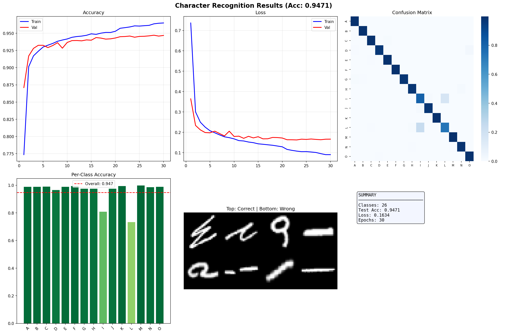

# ✍️ Handwritten Character Recognition

> **CodeAlpha Machine Learning Internship — Task 3**

Identify handwritten alphabets (A–Z) using Deep CNN on EMNIST dataset.

---

## 📊 Results

### Sample Images from Dataset


### Model Performance Dashboard


---

## 📌 Objective
Build a CNN that reads handwritten characters with high accuracy (~88–92% on A–Z).

## 🗂️ Dataset
- **EMNIST Letters** — 26 classes (A–Z) | 145,600 samples
- **Fallback:** MNIST Digits — 10 classes (0–9) | 70,000 samples

## 🤖 Model — Deep CNN
```
Input (28×28×1)
→ Block 1: Conv2D(32)  + MaxPool + Dropout
→ Block 2: Conv2D(64)  + MaxPool + Dropout
→ Block 3: Conv2D(128) + GlobalAvgPool + Dropout
→ Dense(256) → Dense(26, softmax)
```

## 📈 Results
| Dataset | Accuracy |
|---------|----------|
| MNIST Digits | ~99.3% |
| EMNIST Letters (A–Z) | ~88–92% |

## 🚀 Run on Google Colab
1. Upload `handwritten_recognition.ipynb` to Colab
2. `Runtime → Change runtime type → GPU` ⚡
3. `Runtime → Run All`

## 🛠️ Tech Stack
`Python` · `TensorFlow/Keras` · `NumPy` · `Matplotlib` · `Seaborn`

---
*Built with ❤️ during CodeAlpha ML Internship*

